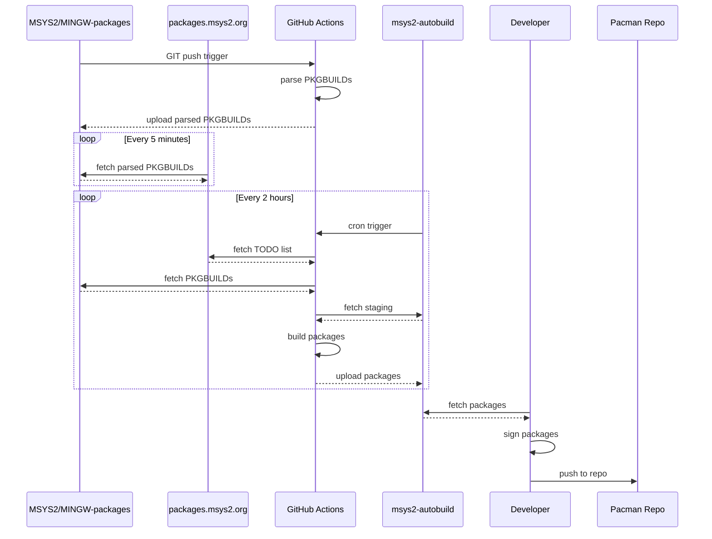

# msys2-autobuild

## CLI

```console
$ pacman -S mingw-w64-x86_64-python-tabulate mingw-w64-x86_64-python-pygithub mingw-w64-x86_64-python-requests
# or
$ poetry install
# or
$ python -m pip install --user -r requirements.txt
```

```console
$ msys2-autobuild --help
usage: msys2-autobuild [-h] [-R REPO]
                       {build,show,write-build-plan,update-status,fetch-assets,upload-assets,clear-failed}
                       ...

Build packages

options:
  -h, --help            show this help message and exit
  -R REPO, --repo REPO  msys2-autobuild repository to target (default 'msys2/msys2-autobuild')

subcommands:
  {build,show,write-build-plan,update-status,fetch-assets,upload-assets,clear-failed}
    build               Build all packages
    show                Show all packages to be built
    write-build-plan    Write a GHA build matrix setup
    update-status       Update the status file
    fetch-assets        Download all staging packages
    upload-assets       Upload packages
    clear-failed        Clear the failed state for packages
```

## Automated Build Process

The following graph shows what happens between a PKGBUILD getting changed in git
and the built package being available in the pacman repo.



### Security Considerations

Assuming changes to PKGBUILDs are properly reviewed, the pacman signature
checking works, the upstream source is OK and all MSYS2 organization members are
trusted we need to consider a bad actor controlling some part of the building
process between the PKGBUILD getting changed and the package ending up signed in
the pacman repo.

A bad actor would need to get a package on the machine of the developer signing
the package and adding it to the pacman repo. We take the following precautions:

* We only build packages automatically with GitHub Actions without third party
  actions, excluding the official GitHub ones. We assume the GHA images and
  official actions are safe.
* The download tool used by the person signing the package checks that the
  binaries where uploaded by a restricted set of GitHub users or GHA.
  We assume the bad actor doesn't have git push rights.
* Packages too large for GHA get built/signed by MSYS2 developers on their
  machines. We assume the developer machines are safe.
* We enforce 2FA for the MSYS2 organization to make account takeovers of
  existing MSYS2 developers harder.

Feedback and ideas on how to improve this welcome.
